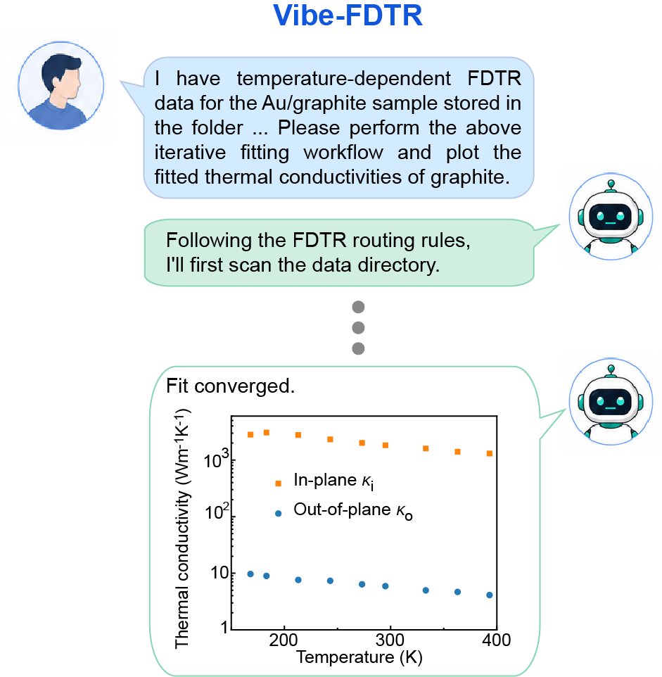

# Vibe-FDTR

[](https://arxiv.org/abs/2607.28200)
[](LICENSE)

Agent-oriented toolkit for reproducible frequency-domain thermoreflectance
(FDTR) data analysis, from the paper
[**Vibe-FDTR: An agent-oriented framework for reproducible frequency-domain
thermoreflectance data analysis**](https://arxiv.org/abs/2607.28200)
(Fuwei Yang, Weiheng Li, Bai Song).

It gives any AI agent the ability to perform thermal-property fitting,
sensitivity analysis, and uncertainty quantification on FDTR measurements
through natural-language conversation. The agent handles config generation,
CLI execution, and result interpretation; you just describe what you want.

Evaluated by [**Vibe-FDTR-Bench**](https://github.com/lwh9346/Vibe_FDTR_benchmarks),
a companion benchmark suite that runs coding agents on FDTR tasks in isolated
containers and grades their outputs against calibrated ground truth.

<p align="center">
  
</p>

## Install

Paste this into your agent:

```text
Clone https://github.com/yfwsunny/Vibe_FDTR and install it by following AGENTS.md.
```

## Usage

See [AGENTS.md](AGENTS.md) for the agent workflow, routing, and conventions,
and `CLAUDE.md` plus `.claude/skills/` for the individual skills and CLI
reference.

## Citation

```bibtex
@article{yang2026vibefdtr,
  title   = {Vibe-FDTR: An agent-oriented framework for reproducible
             frequency-domain thermoreflectance data analysis},
  author  = {Yang, Fuwei and Li, Weiheng and Song, Bai},
  journal = {arXiv preprint arXiv:2607.28200},
  year    = {2026}
}
```

## License

[MIT](LICENSE)
